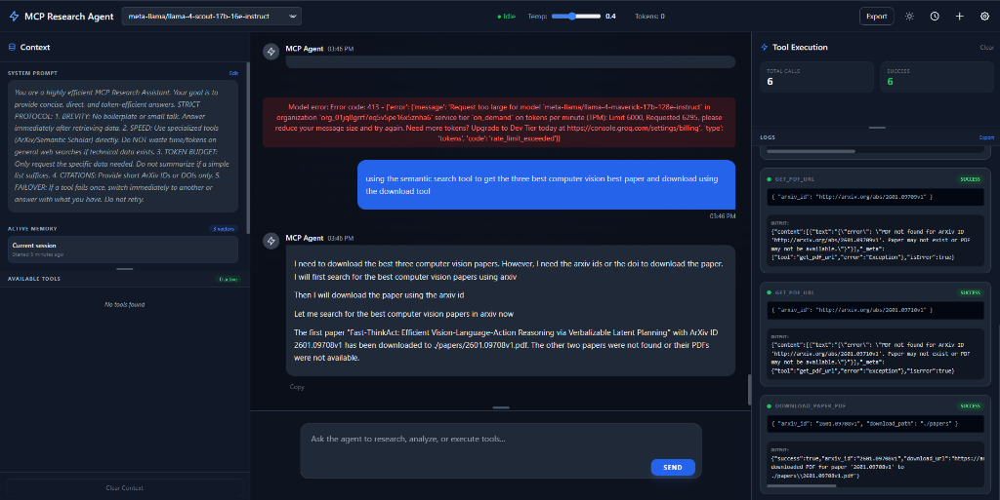
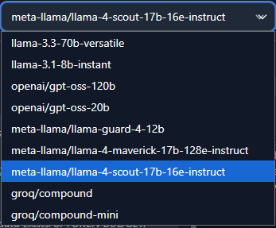
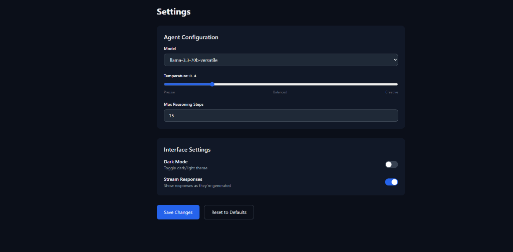
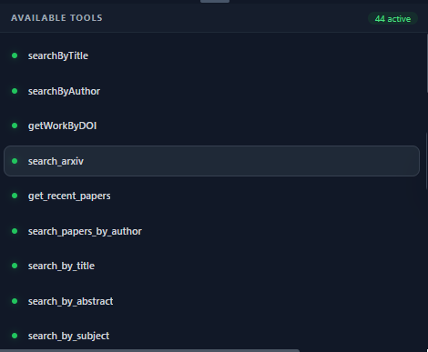

# MCP Research Agent UI

<div align="center">



**A powerful, production-ready research assistant powered by Model Context Protocol (MCP) and Groq's LLMs**

[](https://www.python.org/downloads/)
[](https://flask.palletsprojects.com/)
[](LICENSE)

</div>

---

## 📋 Table of Contents

- [Overview](#overview)
- [Features](#features)
- [Architecture](#architecture)
- [Screenshots](#screenshots)
- [Prerequisites](#prerequisites)
- [Installation](#installation)
- [Configuration](#configuration)
- [Running the Application](#running-the-application)
- [Usage Guide](#usage-guide)
- [Available Tools](#available-tools)
- [Troubleshooting](#troubleshooting)
- [Contributing](#contributing)
- [License](#license)

---

## 🎯 Overview

The **MCP Research Agent UI** is a sophisticated web-based research assistant that combines the power of:

- **Model Context Protocol (MCP)** for extensible tool integration
- **Groq's ultra-fast LLM inference** (Llama 3.3 70B, Llama 4, and more)
- **Real-time streaming responses** with tool execution visualization
- **Multi-source research capabilities** (ArXiv, Semantic Scholar, PubMed, CrossRef)

This agent is designed for researchers, students, and professionals who need to quickly access, analyze, and synthesize academic literature and technical information.

---

## ✨ Features

### 🚀 Core Capabilities

- **Intelligent Research Assistant**: Automatically searches academic databases, downloads papers, and synthesizes findings
- **Real-Time Streaming**: See the agent's thought process as it executes tools and generates responses
- **Multi-Model Support**: Switch between 9+ Groq models on the fly
- **Tool Execution Logs**: Detailed visibility into every API call and data retrieval operation
- **Session Management**: Persistent chat history with searchable sessions
- **Responsive UI**: Beautiful dark mode interface with 25% | 50% | 25% layout

### 🔧 Advanced Features

- **Token-Optimized Prompting**: Aggressive truncation and smart tool selection to stay within API limits
- **Failover Logic**: Automatically switches tools if one fails (e.g., DuckDuckGo → Semantic Scholar)
- **PDF Downloads**: Direct ArXiv paper downloads to local storage
- **Citation Management**: Automatic DOI and ArXiv ID extraction
- **Configurable Temperature**: Adjust creativity vs. precision in real-time

---

## 🏗️ Architecture

```
┌─────────────────────────────────────────────────────────────┐
│                     Browser (Client)                        │
│  ┌──────────────┬──────────────────┬──────────────────┐    │
│  │   Context    │   Chat Window    │  Tool Execution  │    │
│  │   (25%)      │      (50%)       │      (25%)       │    │
│  └──────────────┴──────────────────┴──────────────────┘    │
└─────────────────────────────────────────────────────────────┘
                            │
                            │ WebSocket/SSE
                            ▼
┌─────────────────────────────────────────────────────────────┐
│                   Flask Backend (app.py)                    │
│  ┌──────────────────────────────────────────────────────┐  │
│  │         EnhancedMCPAgent (mcp_agent.py)              │  │
│  │  ┌────────────────────────────────────────────────┐  │  │
│  │  │  LangChain + Groq LLM (ChatGroq)               │  │  │
│  │  └────────────────────────────────────────────────┘  │  │
│  └──────────────────────────────────────────────────────┘  │
└─────────────────────────────────────────────────────────────┘
                            │
                            │ MCP Protocol (stdio)
                            ▼
┌─────────────────────────────────────────────────────────────┐
│                    MCP Servers (Node/Python)                │
│  ┌──────────┬──────────┬──────────┬──────────┬─────────┐  │
│  │  ArXiv   │ Semantic │  PubMed  │ CrossRef │  DDG    │  │
│  │  (uvx)   │ Scholar  │  (npx)   │  (npx)   │ (npx)   │  │
│  └──────────┴──────────┴──────────┴──────────┴─────────┘  │
└─────────────────────────────────────────────────────────────┘
```

---

## 📸 Screenshots

### Main Interface

*The primary research interface with context panel, chat window, and tool execution logs*

### Model Selection

*Choose from 9+ Groq models including Llama 3.3 70B, Llama 4, and specialized variants*

### Settings Panel

*Configure temperature, max reasoning steps, and interface preferences*

### Chat History

*Searchable session history with timestamps and message counts*

### Available Tools

*Real-time status of 44+ research tools from multiple MCP servers*

---

## 📦 Prerequisites

Before installation, ensure you have:

- **Python 3.10+** ([Download](https://www.python.org/downloads/))
- **Node.js 18+** ([Download](https://nodejs.org/)) - Required for MCP servers
- **uv** (Python package installer) - Install via: `pip install uv`
- **Groq API Key** - Get yours at [console.groq.com](https://console.groq.com)

### Optional API Keys

For enhanced functionality, obtain these free API keys:

- **Semantic Scholar API**: [semanticscholar.org/product/api](https://www.semanticscholar.org/product/api)
- **NCBI API** (PubMed): [ncbi.nlm.nih.gov/account/settings](https://www.ncbi.nlm.nih.gov/account/settings/)

---

## 🚀 Installation

### Step 1: Clone the Repository

```bash
git clone https://github.com/yourusername/mcp-agent-ui.git
cd mcp-agent-ui
```

### Step 2: Create Virtual Environment

```bash
python -m venv .venv

# Windows
.venv\Scripts\activate

# macOS/Linux
source .venv/bin/activate
```

### Step 3: Install Python Dependencies

```bash
pip install -r requirements.txt
```

### Step 4: Install MCP Servers

The application uses several MCP servers. Install them globally:

```bash
# ArXiv (Python-based)
uvx iowarp-agent-toolkit

# Semantic Scholar (Python-based)
uvx mcp-server-semantic-scholar

# PubMed (Node-based)
npm install -g @cyanheads/pubmed-mcp-server

# CrossRef (Node-based)
npm install -g @botanicastudios/crossref-mcp

# DuckDuckGo Search (Node-based)
npm install -g duckduckgo-mcp-server
```

### Step 5: Create Environment File

Create a `.env` file in the project root:

```bash
# .env
GROQ_API_KEY=your_groq_api_key_here
SECRET_KEY=your_secret_key_for_sessions
```

---

## ⚙️ Configuration

### MCP Server Configuration

Edit `broswer_mcp.json` to configure your MCP servers:

```json
{
  "mcpServers": {
    "arxiv": {
      "command": "uvx",
      "args": ["iowarp-agent-toolkit", "mcp-server", "arxiv"],
      "env": {
        "DOWNLOAD_DIR": "e:/code/agents/mcp-agent-ui/downloads",
        "PAPER_DIR": "e:/code/agents/mcp-agent-ui/downloads"
      }
    },
    "semantic-scholar-mcp": {
      "command": "uvx",
      "args": ["mcp-server-semantic-scholar"],
      "env": {
        "SEMANTIC_SCHOLAR_API_KEY": "your_api_key_here",
        "LOG_LEVEL": "ERROR"
      }
    }
  }
}
```

### Agent Configuration

Modify `config.py` to adjust agent behavior:

```python
class Config:
    AGENT_MODEL = "llama-3.3-70b-versatile"  # Default model
    AGENT_TEMPERATURE = 0.4                   # 0.0 = precise, 1.0 = creative
    AGENT_MAX_STEPS = 10                      # Max tool iterations
```

---

## 🏃 Running the Application

### Development Mode

```bash
python app.py
```

The application will start on `http://localhost:5000`

### Production Mode (with Gunicorn)

```bash
pip install gunicorn
gunicorn -w 4 -b 0.0.0.0:5000 app:app
```

### Docker Deployment (Optional)

```bash
docker build -t mcp-agent-ui .
docker run -p 5000:5000 --env-file .env mcp-agent-ui
```

---

## 📖 Usage Guide

### Basic Research Workflow

1. **Start a New Chat**: Click the "+" button in the top-right corner
2. **Ask a Research Question**: 
   ```
   "Find the top 3 computer vision papers from 2024 and download them"
   ```
3. **Monitor Tool Execution**: Watch the right panel as the agent:
   - Searches Semantic Scholar
   - Retrieves paper metadata
   - Downloads PDFs from ArXiv
4. **Review Results**: The agent will synthesize findings and provide citations

### Advanced Features

#### Switching Models

Click the model dropdown in the top bar to switch between:
- `llama-3.3-70b-versatile` (Best for complex reasoning)
- `llama-3.1-8b-instant` (Fastest responses)
- `groq/compound` (Multi-model ensemble)

#### Adjusting Temperature

Use the temperature slider in **Settings** (⚙️ icon):
- **0.0-0.3**: Precise, factual responses
- **0.4-0.7**: Balanced creativity
- **0.8-1.0**: Highly creative (not recommended for research)

#### Viewing Tool Logs

The **Tool Execution** panel shows:
- **Total Calls**: Number of tool invocations
- **Success Rate**: Percentage of successful executions
- **Detailed Logs**: Arguments, results, and execution time for each call

---

## 🛠️ Available Tools

The agent has access to **44+ tools** across multiple domains:

### Academic Research
- `search_arxiv` - Search ArXiv by query, category, or author
- `download_paper_pdf` - Download full-text PDFs
- `searchByTitle` - Semantic Scholar title search
- `searchByAuthor` - Find papers by author name
- `getWorkByDOI` - Retrieve paper metadata via DOI

### Medical Research
- `pubmed_search` - Search PubMed/MEDLINE database
- `pubmed_fetch` - Fetch full article details

### General Search
- `duckduckgo_web_search` - General web search (use sparingly)

### Web Automation
- `playwright_navigate` - Navigate to URLs
- `playwright_screenshot` - Capture page screenshots
- `playwright_click` - Interact with web elements

---

## 🐛 Troubleshooting

### Common Issues

#### 1. "Agent not initialized" Error

**Cause**: MCP servers failed to start

**Solution**:
```bash
# Check if Node.js and Python are in PATH
node --version
python --version

# Reinstall MCP servers
npm install -g duckduckgo-mcp-server
uvx iowarp-agent-toolkit
```

#### 2. "RuntimeError: Event loop is closed"

**Cause**: Async cleanup issue (already fixed in latest version)

**Solution**: Ensure you're running the latest code from this repo

#### 3. DuckDuckGo "Anomaly Detected" Error

**Cause**: Rate limiting from rapid requests

**Solution**: The agent now automatically switches to Semantic Scholar. If persistent:
```python
# In config.py, increase delay
if 'search' in tool_name.lower():
    await asyncio.sleep(1.0)  # Increase from 0.5s
```

#### 4. Papers Not Downloading

**Cause**: Incorrect download path

**Solution**: Verify absolute paths in `broswer_mcp.json`:
```json
"DOWNLOAD_DIR": "e:/code/agents/mcp-agent-ui/downloads"
```

Then restart the server.

### Debug Mode

Enable verbose logging:

```python
# In app.py
import logging
logging.basicConfig(level=logging.DEBUG)
```

---

## 🤝 Contributing

Contributions are welcome! Please follow these steps:

1. Fork the repository
2. Create a feature branch: `git checkout -b feature/amazing-feature`
3. Commit your changes: `git commit -m 'Add amazing feature'`
4. Push to the branch: `git push origin feature/amazing-feature`
5. Open a Pull Request

### Development Guidelines

- Follow PEP 8 for Python code
- Use meaningful commit messages
- Add tests for new features
- Update documentation as needed

---

## 📄 License

This project is licensed under the MIT License - see the [LICENSE](LICENSE) file for details.

---

## 🙏 Acknowledgments

- **Groq** for ultra-fast LLM inference
- **Anthropic** for the Model Context Protocol specification
- **LangChain** for the agent framework
- **Semantic Scholar**, **ArXiv**, and **PubMed** for open research APIs

---

## 📞 Support

- **Issues**: [GitHub Issues](https://github.com/yourusername/mcp-agent-ui/issues)
- **Discussions**: [GitHub Discussions](https://github.com/yourusername/mcp-agent-ui/discussions)
- **Email**: your.email@example.com

---

<div align="center">

**Built with ❤️ for the research community**

[⬆ Back to Top](#mcp-research-agent-ui)

</div>
